# FoodBridge — Detailed Software Engineering Report

This detailed report expands the existing project3 report into a single, focused deliverable covering: Introduction & Context, Requirements (functional and non-functional), Subsystem Overview, and the Architecture Framework (stakeholders, concerns, and viewpoints per IEEE 42010). Use the `diagrams/` folder for source diagrams and `scripts/render_diagrams.*` to render images locally.

Repository link: https://github.com/Priyanshu-Jha/FoodBridge-

---

## 1. Introduction & Context

### 1.1 Problem Statement
FoodBridge is designed to reduce food wastage by connecting individual and institutional donors with local NGOs and food banks. The platform allows donors to publish surplus food listings (type, quantity, pickup window, storage constraints), and enables verified NGOs to discover, claim, and coordinate pickups. The problem is important because inefficiencies in donation routing and visibility lead to avoidable spoilage and missed opportunities to feed vulnerable populations.

### 1.2 Why This Problem Matters (expanded)
Beyond the moral imperative of reducing hunger, there are measurable social and environmental costs to food waste. Food wasted at source represents lost labor, transportation, and energy investments; when discarded it contributes to landfill methane emissions. A reliable donation platform reduces administrative friction, improves the match rate between surplus and need, and enables local communities to respond faster during events such as festivals or emergencies. From a software engineering perspective, the problem is interesting because it requires handling real-time events, geographic matching, role-based access, and robust fault-tolerance under bursty demand.

### 1.3 System Goals (detailed)
- Scalability: Gracefully handle spikes (relief drives) with stateless services, horizontal API scaling, and partitionable storage.
- Security & Privacy: Protect personal and organizational data; enforce least privilege, secure credentials, TLS-only, and auditable logs.
- Maintainability & Extensibility: Modular code with clear domain boundaries and clean cross-cutting concern separation.

---

## 2. Task 1 — Requirements & Subsystems

### 2.1 Functional Requirements (comprehensive)
Below are the core functional requirements with acceptance criteria and architectural impact notes. These are prioritized for an initial pilot with production-readiness in mind.

- User Registration & Authentication
  - Requirement: Users (Donor, NGO Agent, Admin) can register, verify contact (email/phone), log in, reset passwords, and obtain tokens (access + refresh).
  - Acceptance: Registration + verification within 5 minutes; login returns token <200ms.
  - Architectural significance: Governs token strategy, RBAC enforcement, and gateway integration.

- Role-Based Access Control (RBAC)
  - Requirement: Roles enforced across APIs; resource-level checks (owner/organization boundaries).
  - Acceptance: Unauthorized access returns 403; Admin can manage roles.
  - Architectural significance: Drives central policy enforcement and caching of authorization decisions.

- Create / Update / Delete Food Listing
  - Requirement: Donors create listings with perishability, quantity, pickup window, location, media; edit/cancel allowed.
  - Acceptance: Create returns 201 and listing appears in search within indexing window S.
  - Architectural significance: Transactional writes + media handling + event emission.

- Discovery / Search & Filtering
  - Requirement: Proximity-based filtering, freshness, category, pagination, sorting by distance/freshness.
  - Acceptance: First-page results <200ms under baseline; supports radius/bbox queries.
  - Architectural significance: Drives geospatial indexing (PostGIS/ElasticSearch) and cache design.

- Claiming & Reservation Flow
  - Requirement: NGOs claim listings atomically; supports timeouts and confirmation flows.
  - Acceptance: Only one successful claim; state durable and notifications emitted.
  - Architectural significance: Requires strong consistency (transactions/locks) and idempotent APIs.

- Pickup Confirmation (QR / PIN)
  - Requirement: Secure handover confirmation mechanism to mark completion.
  - Acceptance: Confirmation changes state to `completed`; invalid attempts rejected.
  - Architectural significance: Token lifecycle and audit trail requirements.

- Notifications & Audit Trail
  - Requirement: Queue and deliver email/SMS/push; persist immutable audit logs for compliance.
  - Acceptance: Retries for delivery; audit queries available for 90 days.
  - Architectural significance: Message broker, durable storage, and retention policies.

- Organization Verification Workflow
  - Requirement: Admin verification of NGOs with secure document upload and status tracking.
  - Acceptance: Verified orgs flagged; unverified have restricted capabilities.
  - Architectural significance: Workflow engine and secure document storage.

- Media Storage & Delivery
  - Requirement: Store media in object storage, serve via CDN, generate thumbnails asynchronously.
  - Acceptance: Uploads succeed, thumbnails available, signed URLs for access control.
  - Architectural significance: Offloads DB, requires processing workers and CDN integration.

- Reporting 
  - Constraints: Must enforce TLS and token validation with <50ms added latency; must support per-tenant rate limits and preserve client IP for geo-logging. Operationally, configuration changes require safe rollout (canary) to avoid mass outages. Budget: prefer managed API gateway if cost allows.
  - Requirement: Aggregated metrics and exports for operations and stakeholders.
  - Acceptance: Dashboards reflect data within 10s and provide CSV export.
  - Architectural significance: Analytics pipeline and read-optimized stores.

- API & Integration Contracts
  - Requirement: Versioned OpenAPI specs for frontend and third parties.
  - Acceptance: APIs documented; breaking changes follow versioning policy.
  - Constraints: Must meet security standards (bcrypt/argon2 for hashes, TLS, secrets management) and compliance (PII retention and deletion). Token TTLs balance security vs UX (e.g., 15min access, 7d refresh). Audit logs for auth events must be tamper-evident.
  - Architectural significance: Enables contract-driven development and gateway routing.

### 2.2 Non-Functional Requirements (measurable)
- Performance: Median API latency <100ms; 95th percentile <250ms for read endpoints at 200 req/s. Create/claim median <150ms.
- Scalability: Autoscale to 1000 req/s for bursts; prefer stateless services.
- Consistency: Strong consistency for listing lifecycle; eventual consistency for search (<10s lag).
- Reliability: 99.9% availability for critical APIs.
  - Constraints: Must guarantee atomic claim semantics (no double-claim) under concurrent load; claim latency target <300ms. Data model must retain minimal PII and support deletion requests. Storage cost constraints favor compact listing records; heavy media is stored separately.
- Security: TLS 1.2+, RBAC, JWT with rotation, encryption-at-rest for PII.
- Privacy & Governance: 90-day audit retention; data deletion on request.
- Observability: Prometheus, OpenTelemetry traces, centralized logs, alerts for SLO violations.
- Maintainability: 80%+ unit coverage for core modules; CI gating.
- Usability: Listing creation under 60s; WCAG AA compliance for critical pages.
- Extensibility: Pluggable notification adapters and search backends.
- Cost: Prefer managed DB and storage for pilot; monitor spend and optimize.
  - Constraints: Must meet search latency SLOs (95th pct <250ms) under baseline load; geospatial queries should support radius queries with configurable max radius. Index storage must be bounded (rollover/retention) to control cost. Indexer must handle eventual consistency guarantees (<10s lag target).

### 2.3 Subsystem Overview (roles & responsibilities)
### 2.3 Key Requirements and Architectural Significance

Below are the highest-impact requirements (both functional and non-functional) that directly drive architectural choices. For each item we explain why it is architecturally significant and what design constraints or patterns it implies.

- **Low-latency geospatial discovery (Search)**
  - Constraints: Delivery latency is best-effort; critical notifications should be attempted promptly but non-blocking. Must provide retry semantics and DLQ for failed messages. Compliance: message content must avoid leaking PII; opt-in consent must be respected.
  - Significance: Proximity queries are on the critical path for NGO discovery and directly affect UX. This drives the decision to use spatial indexes (PostGIS) or a dedicated search engine (ElasticSearch) with geospatial capabilities, plus caching for hot queries and read replicas.

- **Atomic claim semantics (Consistency)**
  - Significance: Preventing double-claims is a correctness requirement that mandates transactional guarantees. This constrains the choice of primary data store (strongly consistent relational DB) or requires robust distributed locking when services are scaled.

- **Burst tolerance and queueing (Scalability & Resilience)**
  - Significance: Event-driven spikes (festivals, emergencies) require buffering non-critical work (notifications, indexing). This implies a message broker, backpressure strategies, and autoscaling rules for workers and API servers.
  - Constraints: Verification artifacts are sensitive — must be encrypted at rest and access-controlled; retention policies govern how long documents persist. Audit trails required for verification actions.

- **Security and RBAC enforcement**
  - Significance: Access control is core to trust in the system; enforcing RBAC at the gateway or service layer impacts token design, middleware placement, and caching of policy decisions for performance.

- **Notifications & durable audit trail**
  - Significance: Delivery guarantees and auditability require reliable queues, idempotent workers, and append-only audit storage with clear retention policies; this affects storage choices and compliance design.

  - Constraints: Media uploads may be large; impose size limits and content-type validation. Signed URLs should expire within a short window (e.g., 1 hour) for security. Storage cost caps and CDN caching TTLs should be configurable to control operational expense.
- **Media handling at scale (media service + CDN)**
  - Significance: Storing images and attachments off the primary DB reduces DB load and cost; requires an object store, thumbnailing pipeline, signed URL design, and CDN integration for low-latency delivery.

- **Observability from day one**
  - Significance: Tracing and metrics are required to debug distributed flows (claim → notify → index). Instrumentation decisions influence framework choices and deployment of collectors (OpenTelemetry, Prometheus).

- **Availability & operational simplicity**
  - Constraints: Must capture distributed traces for critical flows; sampling must balance cost vs fidelity. Retention windows for traces/logs must be set to preserve budget while meeting audit needs (e.g., 90 days for audit logs, 30 days for traces).
  - Significance: A 99.9% target pushes for redundancy, health checks, and favoring managed services to reduce operational overhead.

- **Privacy & compliance**
  - Significance: PII handling and retention policies constrain how user data and audit logs are stored and purged; also impacts encryption and key management choices.

These key requirements should be used as acceptance criteria for architecture trade-offs: any chosen pattern must explain how it satisfies these items.

  - Constraints: Data retention and anonymization requirements apply; analytics must support GDPR-like deletion requests. ETL windows should avoid impacting production DB performance; prefer read-replica or change-data-capture feeds.
### 2.4 Subsystem Overview (roles & responsibilities)
The system decomposes into the following subsystems. For each, a corresponding Mermaid source diagram exists under `diagrams/` (e.g., `diagrams/subsystem_donation.mmd`). Each subsystem description below adds explanation of primary data models, public interfaces, scaling considerations, and failure modes.

- **API Gateway**
  - Role: Ingress, TLS termination, routing, rate limiting, auth delegation and API versioning.
  - Primary data: No persistent data; stores ephemeral rate-limit counters (Redis) and routing rules.
  - Public interfaces: HTTP/HTTPS endpoints, health checks, metrics endpoint.
  - Scaling: Horizontally scalable; stateless when paired with external token introspection and rate-limit store.
  - Failure modes: Misconfiguration can block all traffic; fallback routing and circuit-breakers are required.

- **Authentication & Identity Service**
  - Role: Manage user accounts, verification, token issuance (access + refresh), password reset, and optional MFA.
  - Primary data: User profiles, credential hashes, refresh tokens, MFA state — stored in Auth DB.
  - Public interfaces: Registration, login, token refresh, introspection endpoints, user lookup.
  - Scaling: Read-heavy token validation can be cached (Redis); writes (registration) are transactional.
  - Failure modes: Token service outage prevents user login; mitigate with short-lived token caching and clear error UX.

- **Donation Management Service**
  - Role: Implements listing lifecycle (create, edit, cancel, claim, complete) and enforces business rules such as perishability windows and quantity checks.
  - Primary data: `FoodListing`, `Claim`, state transitions recorded in Primary DB; emits events to message queue.
  - Public interfaces: CRUD endpoints for listings, claim endpoint, admin overrides.
  - Scaling: Transactional consistency requirements limit horizontal scaling per partition; shard by region or organization for scale.
  - Failure modes: DB contention during high claim concurrency; mitigate with optimistic concurrency or DB-level transactions and backoff.

- **Search & Discovery Service**
  - Role: Provide low-latency, filterable search including geospatial queries and ranking.
  - Primary data: Search indices (ElasticSearch or Redis geo-indexes), derived from Primary DB via indexer.
  - Public interfaces: Search API with pagination, sorting and filters.
  - Scaling: Read-scalable; indices replicated across nodes; periodic re-indexing strategy.
  - Failure modes: Index lag leading to temporary inconsistency; provide visibility into index lag and fall back to direct DB queries if needed.

- **Notification & Communication Service**
  - Role: Consume domain events and deliver email/SMS/push; manage retries and delivery status.
  - Primary data: Delivery queue, retry metadata, audit log entries.
  - Public interfaces: Internal event consumer endpoints, delivery status queries for admins.
  - Scaling: Worker pools scale based on queue depth; requires idempotent processing.
  - Failure modes: External provider failures — implement exponential backoff and dead-letter queues.

- **User & Organization Management**
  - Role: Store user/organization profiles, verification artifacts, roles and permissions; expose admin operations for verification.
  - Primary data: Organization documents, verification evidence metadata stored securely.
  - Public interfaces: Admin APIs for verification, endpoints for role management.
  - Scaling: Moderate scale; operations are admin-driven and lower volume.
  - Failure modes: Data leak of verification documents — enforce encryption and strict ACLs.

- **Media Service**
  - Role: Accept uploads, store media in object storage, generate thumbnails, and return signed URLs for consumption via CDN.
  - Primary data: Object store records and metadata.
  - Public interfaces: Upload endpoints, signed URL generation, webhook for processing completion.
  - Scaling: Scales with storage and CDN; offload CPU-bound image processing to worker pool.
  - Failure modes: Slow uploads or corrupted files — validate integrity on upload and retry processing.

- **Monitoring & Observability**
  - Role: Collect metrics, traces, and logs; provide dashboards, alerting and tracing to diagnose distributed flows.
  - Primary data: Time-series metrics, traces and indexed logs.
  - Public interfaces: Metrics scrape endpoints, trace ingestion, and dashboard readouts.
  - Scaling: Backed by scalable collectors and retention policies; partition metrics by service and region.
  - Failure modes: Collector overload — use sampling and rate limits.

- **Reporting & Analytics**
  - Role: Offline analytics, ETL, and OLAP for KPIs and reporting to stakeholders; produces exportable datasets.
  - Primary data: Aggregated metrics, historical snapshots, OLAP cubes.
  - Public interfaces: Dashboards and CSV/JSON export APIs.
  - Scaling: Batch-oriented; scale ETL workers and storage as needed.
  - Failure modes: Pipeline lag or schema drift — ensure schema evolution strategies and monitoring of ETL jobs.

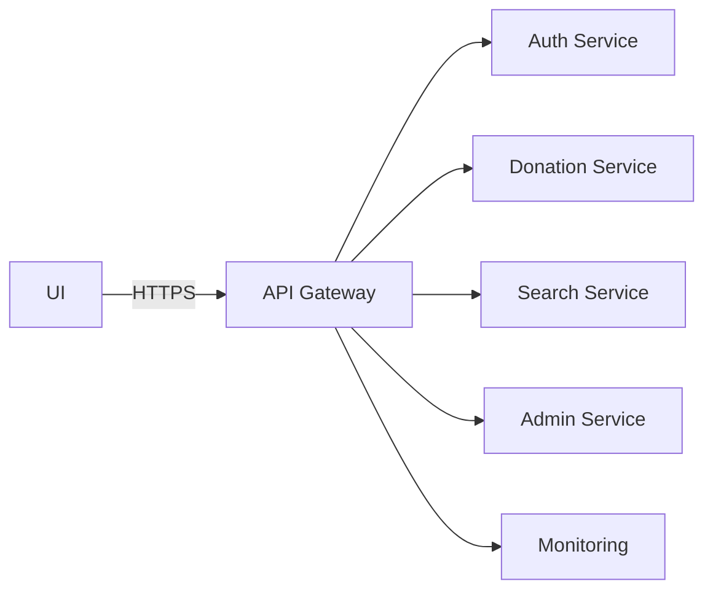

- Authentication & Identity Service
  - Role: User accounts, verification, token issuance (access + refresh), password reset and MFA.
  - Dependencies: Email/SMS provider, token cache (Redis), Auth DB.

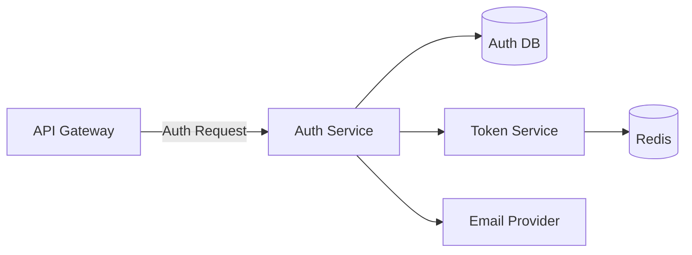

- Donation Management Service
  - Role: Core domain logic for listings lifecycle; emits domain events for indexing and notifications.
  - Dependencies: Primary DB, message queue, media service.

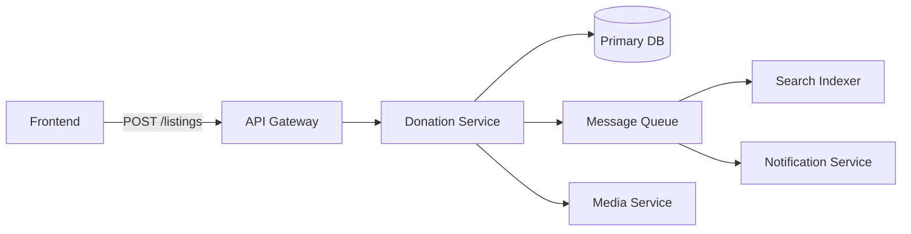

- Search & Discovery Service
  - Role: Serve low-latency queries over indexed data including geospatial filters.
  - Dependencies: ElasticSearch/Redis, indexing pipeline, read replicas.

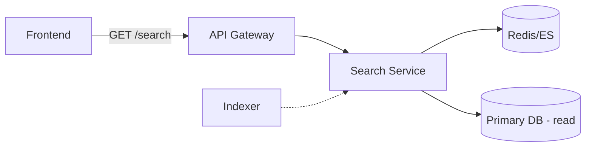

- Notification & Communication Service
  - Role: Consume events, format messages, manage retries/backoff, persist delivery status.
  - Dependencies: Message broker, SMS/email/push providers, audit store.

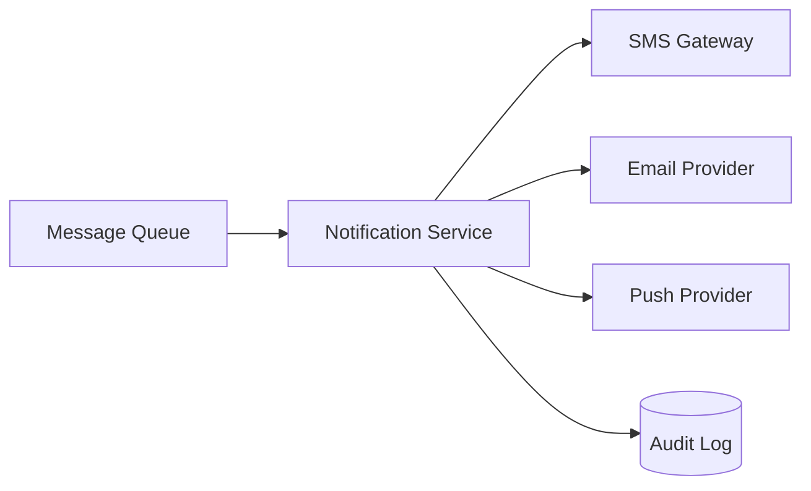

- User & Organization Management
  - Role: Manage profiles, verification artifacts, roles and org metadata.
  - Dependencies: Secure document store, Auth service.

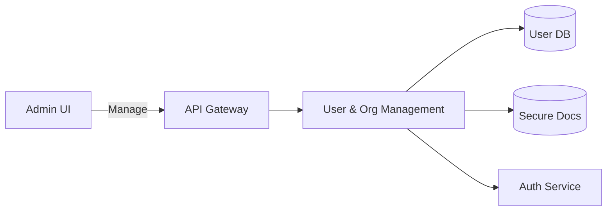

- Media Service
  - Role: Handle uploads, thumbnail generation, signed URLs, and CDN integration.
  - Dependencies: Object store (S3), CDN, image processing workers.

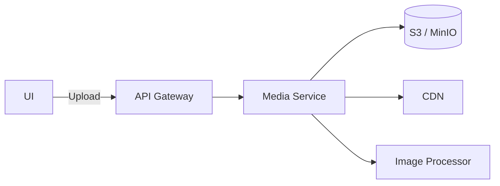

- Monitoring & Observability
  - Role: Collect metrics, traces and logs; provide dashboards and alerts.
  - Dependencies: Prometheus, OpenTelemetry collector, Grafana, alert manager.

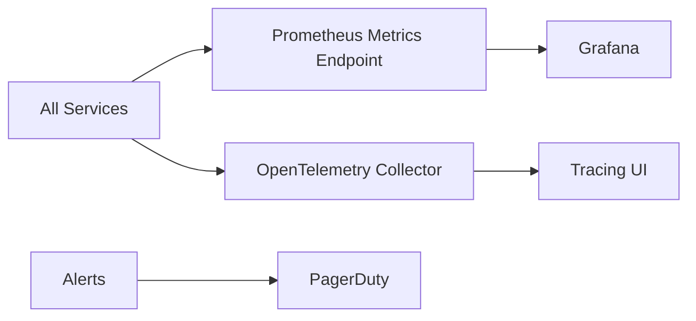

- Reporting & Analytics
  - Role: ETL and OLAP for KPIs and exports; supports business stakeholders and compliance.
  - Dependencies: ETL pipelines, OLAP store.

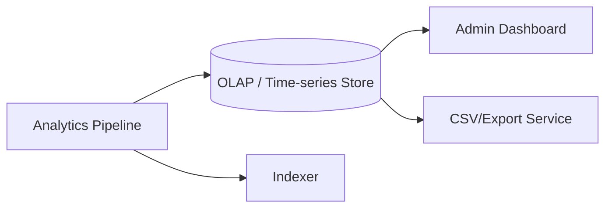

Each subsystem has a Mermaid diagram in `diagrams/`. Render images using `scripts/render_diagrams.ps1` or `scripts/render_diagrams.sh`.

---

## 3. Task 2 — Architecture Framework (IEEE 42010)

### 3.1 Stakeholder Identification (IEEE 42010) — Concise

Below is a concise IEEE 42010 mapping: stakeholder → top concerns → key requirements → architectural impact → views/artifacts → acceptance metric.

- Donors
  - Concerns: fast listing; privacy; pickup confirmation.
  - Key reqs: Create/Manage Listings; Notifications; Privacy NFR.
  - Impact: low-latency write path, secure PII handling, notification pipeline.
  - Views/Artifacts: Use-case sequences, OpenAPI, security data-flow.
  - Metric: 95% creates <200ms; deletion requests honored within 72h.

- NGOs (Recipients)
  - Concerns: discoverability; atomic claims; notification timeliness.
  - Key reqs: Geospatial Search; Claiming/Reservation; RBAC.
  - Impact: geospatial index, transactional claim semantics, org verification.
  - Views/Artifacts: Logical/service view, performance tests, API docs.
  - Metric: Search P95 <250ms; no double-claim in concurrency tests.

- Operators
  - Concerns: verification workflows; observability; retention.
  - Key reqs: User/Org Management; Monitoring; Reporting; Audit Trail.
  - Impact: immutable audit logs, admin APIs, retention/purge pipelines.
  - Views/Artifacts: Operational/deployment view, runbooks, dashboards.
  - Metric: MTTD for critical alerts <5min; audit queries within SLA.

- Developers / Architects
  - Concerns: clear APIs; testability; maintainability.
  - Key reqs: OpenAPI contracts; CI & tests; ADRs.
  - Impact: modular services, contract tests, CI gating.
  - Views/Artifacts: API/interface view, ADR repo, CI configs.
  - Metric: CI green on merge; coverage thresholds met.

- Security & Privacy / Compliance
  - Concerns: PII protection; auditability; incident handling.
  - Key reqs: Security/Privacy NFR; Audit Trail; encryption.
  - Impact: key management, append-only audit store, deletion workflows.
  - Views/Artifacts: Security viewpoint, threat models, compliance reports.
  - Metric: Vulnerability scan results; PII deletion SLA met.

- Regulators / Legal
  - Concerns: lawful processing; records for audits.
  - Key reqs: Privacy & Governance; Audit Trail.
  - Impact: retention policies, data locality controls, DPAs.
  - Views/Artifacts: Compliance view, retention logs, DPAs.
  - Metric: Compliance checklist pass; legal hold supported.

Traceability note: maintain a simple matrix linking stakeholder → concern → requirement → ADR → test; store as a CSV or sheet for grading evidence.

### 3.2 Viewpoints and Views
- Use-case/Scenario Viewpoint: user journeys, acceptance criteria, and sequence diagrams for donor and NGO flows.
- Logical/Service Viewpoint: service boundaries, data flow and domain responsibilities (Donation, Search, Auth).
- Physical/Deployment Viewpoint: container topology, DB clusters, network segmentation, and autoscaling rules.
- Security Viewpoint: authentication, authorization, token lifecycle, encryption, and audit storage.

### 3.3 Mapping Concerns → Views → Artifacts
- Donor usability & privacy → Use-case & Security views → UI wireframes, sequence diagrams, privacy policy artifacts.
- NGO discoverability & latency → Logical & Performance views → Search service design, index schemas, load test plans.
- Operator observability → Operational & Physical views → Prometheus dashboards, runbooks, deployment manifests.
- Developer maintainability → Development & Interface views → Repository layout, ADRs, OpenAPI specs, CI pipelines.

---

## 4. Major Design Decisions (ADRs — Nygard Template)

The following ADRs focus on decisions that are already implemented in this repository. Each record follows the Nygard structure and includes rationale and repository mapping.

### ADR-01: Prototype Backend Technology Choice
- Status: Accepted (Implemented)
- Context: We needed a runnable backend quickly to validate the core flow (`create -> search -> claim`) during project development.
- Decision: Use `Node.js + Express` for the prototype backend with an in-memory store.
- Rationale: This stack is fast to develop, easy to run locally, and integrates smoothly with the existing frontend work.
- Consequences: Prototype is simple and demo-ready, but data is not durable across restarts; production migration is required later.
- Implemented in repository:
  - `prototype/backend/index.js` (Express server + in-memory listing lifecycle)
  - `prototype/backend/README.md` (run steps and endpoint docs)

### ADR-02: API Style for End-to-End Flow Validation
- Status: Accepted (Implemented)
- Context: The project needed a clear and testable API contract for core user actions without introducing heavy infrastructure early.
- Decision: Expose minimal REST endpoints for listing creation, search, claim, and health checks.
- Rationale: REST endpoints are simple to consume, easy to test with cURL/Postman/frontend, and fit the prototype scope.
- Consequences: Fast validation of business flow; some concerns (pagination depth, advanced filtering, async workflows) are intentionally minimal in this prototype phase.
- Implemented in repository:
  - `POST /api/v1/listings` in `prototype/backend/index.js`
  - `GET /api/v1/search` in `prototype/backend/index.js`
  - `POST /api/v1/listings/:id/claim` in `prototype/backend/index.js`
  - `GET /health` in `prototype/backend/index.js`

### ADR-03: Prototype RBAC Enforcement Strategy
- Status: Accepted (Implemented for Prototype)
- Context: We needed role-based behavior in the claim flow, but full JWT auth and identity infrastructure was out of scope for the initial prototype.
- Decision: Enforce role checks using `x-role` header (`NGO` or `ADMIN`) for claim action.
- Rationale: This gives a clear RBAC demonstration with very low implementation cost and supports quick validation during demos.
- Consequences: Suitable only for prototype use; not secure for production and must be replaced by token-based auth + server-side verification.
- Implemented in repository:
  - Role check logic in `prototype/backend/index.js` on claim endpoint
  - Usage documented in `prototype/backend/README.md`

### ADR-04: Listing State Transition Guard for Claims
- Status: Accepted (Implemented)
- Context: The core flow requires correct claim behavior so one listing is not claimed multiple times in normal prototype operation.
- Decision: Model listing lifecycle with explicit `status` and allow claim only when status is `available`; once claimed, update status and claim metadata.
- Rationale: A simple state guard makes business rules explicit and keeps the flow deterministic (`available -> claimed`).
- Consequences: Correct for single-process prototype flow, but not sufficient for distributed/concurrent production traffic; production must enforce this with DB transactions/locking.
- Implemented in repository:
  - Listing creation sets `status: 'available'` in `prototype/backend/index.js`
  - Search returns only `available` items in `prototype/backend/index.js`
  - Claim endpoint blocks non-available listings and updates `status`, `claimedAt`, and `claimedBy` in `prototype/backend/index.js`

These ADRs provide a clear, evidence-backed record of the major design choices already realized in the project repository.

---

## 5. Task 3 — Architectural Tactics (Not Patterns)

This section uses architectural tactics (quality-attribute driven design decisions), not architectural patterns. Below are 5 tactics selected from the provided quality-attribute taxonomy and mapped to FoodBridge.

### 5.1 Tactic: Authorize Users (Security -> Resist Attacks)
- What this tactic means:
  - Every sensitive operation checks whether the caller has sufficient permissions before business logic executes.
- NFRs addressed:
  - Security (access control), Integrity (prevent unauthorized state changes), Reliability (predictable behavior under invalid access).
- How it helps FoodBridge:
  - Prevents unauthorized users from claiming food listings.
  - Reduces misuse of critical actions that affect listing lifecycle.
- Where implemented in repository:
  - `prototype/backend/index.js`: `POST /api/v1/listings/:id/claim` checks `x-role` and returns `403` for insufficient role.
  - `prototype/backend/README.md`: documents `x-role: NGO` / `x-role: ADMIN` prototype usage.
- Implementation explanation:
  - Authorization happens before state mutation: the claim handler reads `x-role`, normalizes it, and rejects unauthorized roles immediately.
  - This gate prevents unauthorized users from changing listing status, so the security check is enforced at the API entry point.

### 5.2 Tactic: Ping/Echo (Availability -> Fault Detection)
- What this tactic means:
  - A lightweight endpoint confirms whether the service process is alive and reachable.
- NFRs addressed:
  - Availability, Operability, Observability.
- How it helps FoodBridge:
  - Enables quick runtime checks during demos, integration, and deployment.
  - Supports basic monitoring and failure detection before users are impacted.
- Where implemented in repository:
  - `prototype/backend/index.js`: `GET /health` endpoint returns service status.
  - `prototype/backend/README.md`: health endpoint included in API documentation.
- Implementation explanation:
  - The health endpoint is intentionally lightweight and independent of business logic, so it can be called frequently by scripts/monitors.
  - Returning a simple status payload allows fast detection of service-process failures during deployment and demos.

### 5.3 Tactic: Reduce Computational Overhead (Performance -> Resource Demand)
- What this tactic means:
  - Keep request processing simple and bounded so each request uses minimal compute.
- NFRs addressed:
  - Performance (response time), Scalability (more requests per node), Cost efficiency.
- How it helps FoodBridge:
  - The prototype avoids heavy processing in search path by filtering only required listing state.
  - Request handlers are short and fail early on invalid input.
- Where implemented in repository:
  - `prototype/backend/index.js`: search returns only `available` items.
  - `prototype/backend/index.js`: create endpoint validates required fields early and returns `400` for invalid payloads.
- Implementation explanation:
  - The create handler uses fail-fast checks (`title`, `quantity`) and exits early on invalid input, reducing unnecessary computation.
  - The search path performs minimal filtering logic (`status === 'available'`) and avoids expensive processing in the hot read path.

### 5.4 Tactic: Use an Intermediary (Modifiability -> Prevent Ripple Effects)
- What this tactic means:
  - Clients interact through an intermediate API layer so internal components can evolve with less impact on clients.
- NFRs addressed:
  - Modifiability, Maintainability, Evolvability.
- How it helps FoodBridge:
  - Keeps frontend decoupled from internal storage/model changes.
  - Supports future migration from in-memory prototype to persistent services without changing client interaction model drastically.
- Where implemented in repository:
  - `prototype/backend/index.js`: REST API acts as the intermediary between clients and data state.
  - `project3_report_detailed.md` (Section 2.4): architecture decomposition includes `API Gateway` as intermediary in target architecture.
  - `diagrams/subsystem_gateway.mmd`: gateway-level intermediary role documented in design artifacts.
- Implementation explanation:
  - Clients call stable REST endpoints instead of directly touching storage concerns, so internal data handling can evolve behind the API layer.
  - This intermediary boundary reduces ripple effects on frontend clients when backend internals (storage/indexing/messaging) change.

### 5.5 Tactic: Separate Interface from Implementation (Testability -> Manage Input/Output)
- What this tactic means:
  - Expose stable interfaces (API contracts) so testing can target behavior without coupling to internal implementation details.
- NFRs addressed:
  - Testability, Maintainability, Modifiability.
- How it helps FoodBridge:
  - Enables easy API-level testing of create/search/claim flow via cURL, Postman, or frontend.
  - Allows backend refactors while preserving API behavior expectations.
- Where implemented in repository:
  - `prototype/backend/index.js`: clearly separated endpoint interfaces for create/search/claim/health.
  - `prototype/backend/README.md`: endpoint contract documentation used as executable testing guide.
- Implementation explanation:
  - The prototype exposes behavior through explicit endpoint contracts, letting tests validate request/response behavior without depending on internal variables.
  - Because interface docs and handlers are aligned, refactoring internals can happen with lower test breakage as long as API contracts stay stable.

---

## 6. Task 4 — Implementation Patterns

This section documents 2 design patterns used (or explicitly planned) in FoodBridge architecture, explains implementation details, and includes UML and sequence diagrams.

### 6.1 Pattern 1: State Pattern (Behavioral)
- Category: Behavioral
- Why this pattern:
  - A food listing has lifecycle-dependent behavior. Actions allowed in one state should be blocked in another.
  - State pattern helps keep transition rules explicit and avoids scattered conditional logic.
- Role in FoodBridge architecture:
  - Controls listing lifecycle such as `available -> claimed -> completed`.
  - Prevents invalid transitions (for example, claiming an already claimed listing).
- Quality attributes supported:
  - Consistency, Reliability, Maintainability.
- Where implemented in repository:
  - `prototype/backend/index.js`: listing created with `status: 'available'`.
  - `prototype/backend/index.js`: claim endpoint checks current status and rejects non-available listings.
  - `prototype/backend/index.js`: successful claim updates `status`, `claimedAt`, `claimedBy`.
- Implementation explanation:
  - Current implementation (repository): lightweight state handling through explicit `status` field and guarded transitions in API handlers.
  - Planned hardening: formalize with `ListingState` interface and concrete state classes (`AvailableState`, `ClaimedState`, `CompletedState`) to reduce conditional branching as lifecycle rules grow.

UML class diagram (State structure):

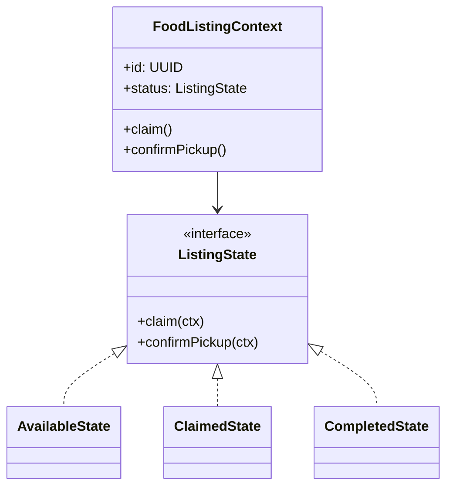

UML state diagram (listing lifecycle):

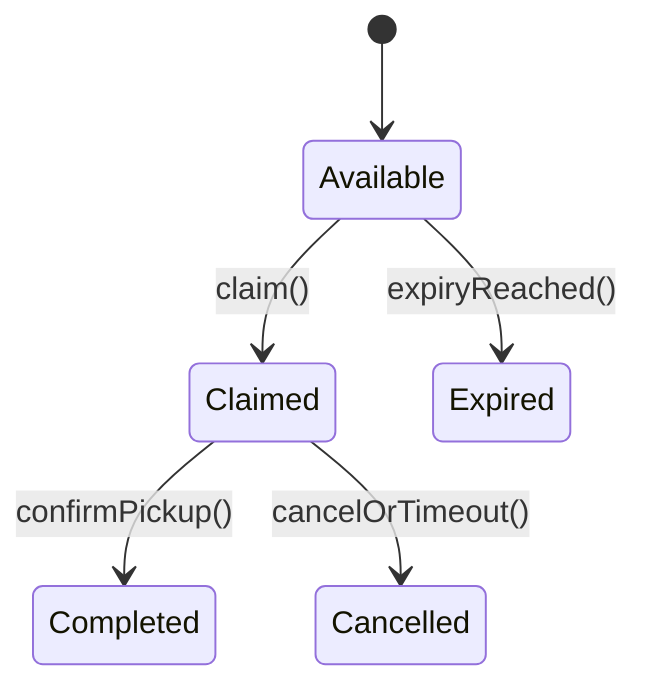

Sequence diagram (claim transition flow):

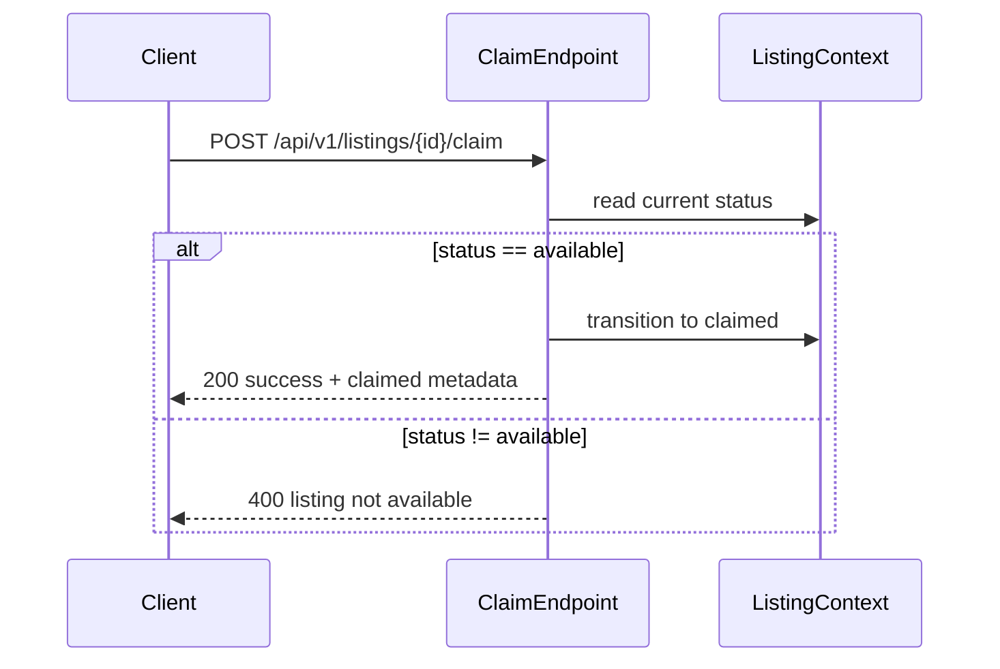

### 6.2 Pattern 2: Observer Pattern (Behavioral)
- Category: Behavioral
- Why this pattern:
  - One domain event (for example, listing claimed) must trigger multiple independent reactions.
  - Observer decouples event producer from consumers.
- Role in FoodBridge architecture:
  - Donation service publishes events.
  - Notification service, search indexer, and audit/reporting consumers subscribe and react independently.
- Quality attributes supported:
  - Scalability, Modifiability, Availability (through asynchronous processing).
- Where implemented in repository:
  - Architecture-level implementation is documented in subsystem/event diagrams:
    - `diagrams/observer_event.mmd`
    - `diagrams/subsystem_notification.mmd`
    - `diagrams/subsystem_search.mmd`
  - `project3_report_detailed.md` section 2.4 also models queue-based fan-out (donation -> queue -> notifier/indexer).
- Implementation explanation:
  - Current implementation (repository): observer flow is implemented at architecture/design level via documented event fan-out diagrams.
  - Planned runtime implementation: donation service publishes domain events to broker; notifier/indexer/audit consumers subscribe independently.

UML class diagram (Observer structure):

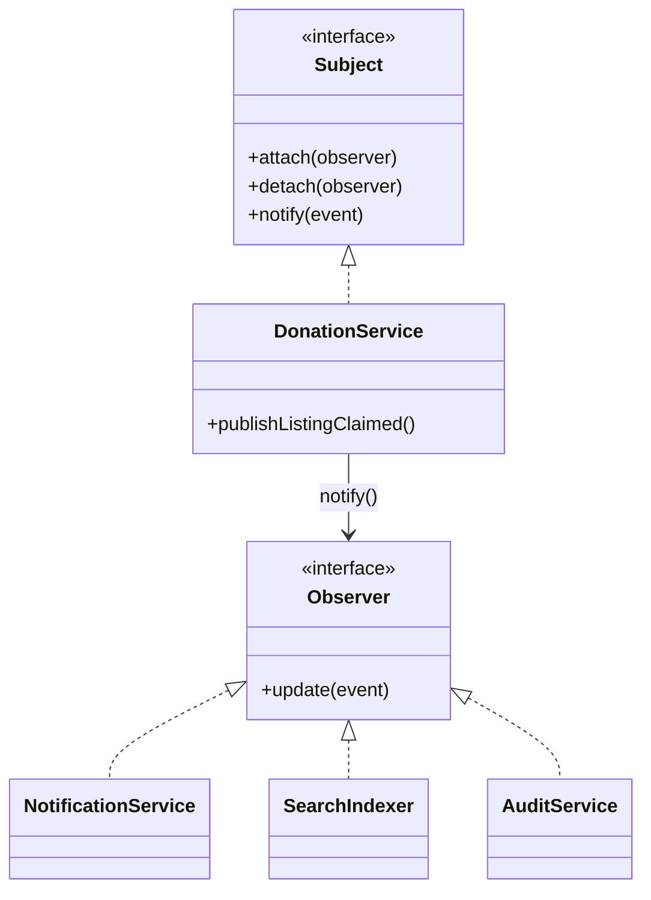

UML-style interaction diagram (Observer flow):

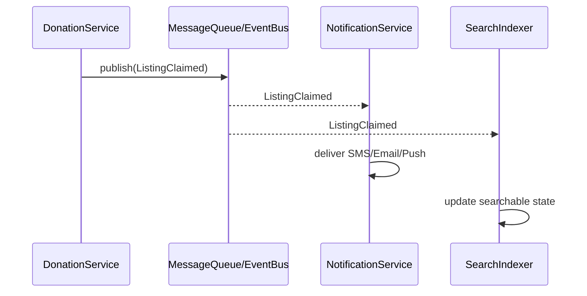

Summary:
- State pattern governs correct listing transitions.
- Observer pattern enables decoupled event-driven reactions across services.
- Together, these patterns support reliable core flows now and scalable evolution later.

---

## 7. Task 4 — Prototype Implementation and Analysis

### 7.1 Implemented Prototype Scope (End-to-End Nontrivial Functionality)

The prototype implements one complete end-to-end flow:

1. Donor creates a food listing.
2. NGO searches available listings.
3. NGO claims one listing with role validation.

This flow is nontrivial because it combines validation, authorization, and lifecycle/state control in one path.

- Implemented repository evidence:
  - `prototype/backend/index.js`:
    - `POST /api/v1/listings` (create)
    - `GET /api/v1/search` (discover)
    - `POST /api/v1/listings/:id/claim` (claim with role + status checks)
  - `prototype/backend/README.md`: run instructions and endpoint usage.

Sequence diagram (implemented end-to-end flow):

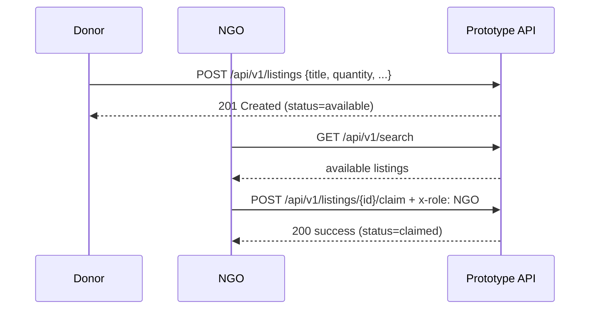

### 7.2 Architectural Patterns (selected from provided list)

The following architectural patterns are selected for FoodBridge, with status and rationale.

#### Pattern A: Monolithic Architecture (implemented in prototype)
- Status: Implemented (prototype)
- Rationale:
  - Fastest path to deliver a working prototype with low operational overhead.
  - Keeps focus on validating business flow before infrastructure complexity.
- Repository mapping:
  - Single runtime service in `prototype/backend/index.js` handles API, domain rules, and in-memory storage.

#### Pattern B: Layered Architecture (implemented in lightweight form)
- Status: Implemented (logical layering)
- Rationale:
  - Clear separation of concerns improves maintainability and testability.
  - API concerns (routing/validation) are kept distinct from business state transitions.
- Repository mapping:
  - `prototype/backend/index.js`:
    - API layer: route handlers
    - Domain layer: claim/state/role rules
    - Data layer: in-memory `listings` store

#### Pattern C: Publish-Subscribe (planned target architecture)
- Status: Planned (documented design)
- Rationale:
  - Decouples donation actions from notifications, indexing, and analytics updates.
  - Improves scalability and resilience for burst events.
- Repository mapping (design artifacts):
  - `diagrams/observer_event.mmd`
  - `diagrams/subsystem_notification.mmd`
  - `diagrams/subsystem_search.mmd`
  - section 2.4 in this report (queue fan-out model)

High-level architecture view (prototype now, pub-sub target path):

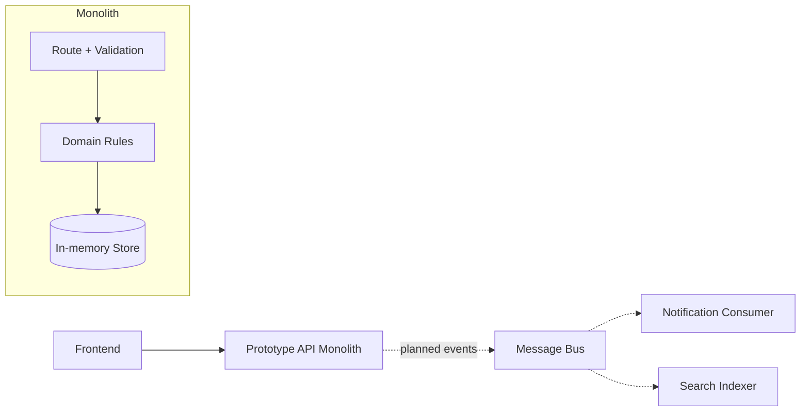

### 7.3 Design Patterns (selected from provided list)

Two design patterns from the provided list are used in this architecture.

#### Pattern 1: Command Pattern (Behavioral)
- Status: Implemented in lightweight form
- Role in architecture:
  - Treat user actions as explicit commands (create listing, claim listing) handled by dedicated endpoint logic.
  - Encapsulates action-specific validation and execution steps.
- Rationale:
  - Improves clarity for write operations and makes command flows easier to test.
- Repository mapping:
  - `prototype/backend/index.js`:
    - create flow = command-style handler (`POST /api/v1/listings`)
    - claim flow = command-style handler (`POST /api/v1/listings/:id/claim`)

UML class diagram (Command-style structure):

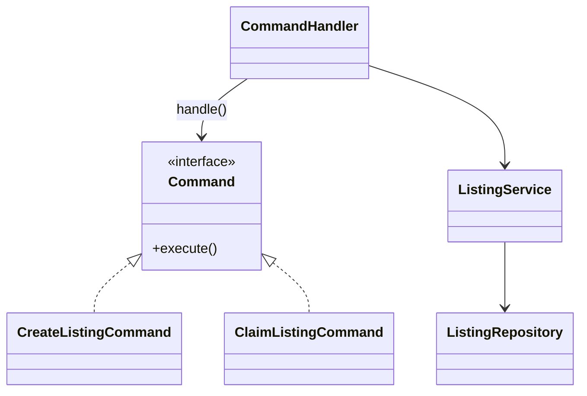

#### Pattern 2: Observer Pattern (Behavioral)
- Status: Planned runtime implementation (already modeled in architecture)
- Role in architecture:
  - On domain events, multiple subscribers react independently (notification, indexing, analytics/audit).
- Rationale:
  - Reduces coupling and allows independent scaling of consumers.
- Repository mapping:
  - `diagrams/observer_event.mmd`
  - `diagrams/subsystem_notification.mmd`
  - `diagrams/subsystem_search.mmd`

Sequence diagram (Observer event fan-out):

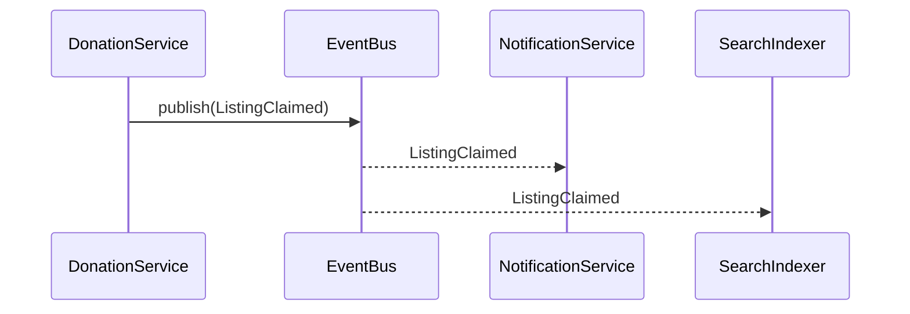

### 7.4 Prototype Analysis (What was validated)

- Validated:
  - End-to-end create -> search -> claim flow works.
  - Unauthorized claim is blocked by role guard.
  - Listing state transition is enforced during claim.
- Not yet implemented in runtime (next iteration):
  - Persistent DB (currently in-memory)
  - Runtime pub-sub broker consumers
  - Full token-based auth and policy engine

This prototype therefore demonstrates practical feasibility of the core workflow and provides a clear path from current implementation to target architecture.

---

## 8. Task 5 — Architecture Analysis (Comparison + Quantification)

This section keeps the same detail level as Part 7 and compares the implemented architecture with a target alternative using measurable non-functional attributes.

### 8.1 Analysis Goal and Scope

- Goal:
  - Evaluate whether the currently implemented prototype architecture is appropriate for pilot-stage traffic.
  - Identify when architectural migration is justified.
- Scope:
  - Core nontrivial flow only: create listing -> search listing -> claim listing.
  - Current implementation baseline from `prototype/backend/index.js`.
  - Target comparison baseline from the documented architecture in section 2.4 and subsystem diagrams.

### 8.2 Architectures Compared

#### Option A: Monolithic + Layered (implemented)
- Current status:
  - Implemented and runnable in repository.
- Structure:
  - Single backend process with route handling, domain rules, and in-memory store.
- Repository evidence:
  - `prototype/backend/index.js`
  - `prototype/backend/README.md`

#### Option B: Microservices + Publish-Subscribe (target)
- Current status:
  - Planned architecture; modeled in report and diagrams.
- Structure:
  - Separate donation/search/notification/auth services with asynchronous event fan-out.
- Design evidence:
  - Section 2.4 subsystem descriptions
  - `diagrams/observer_event.mmd`
  - `diagrams/subsystem_notification.mmd`
  - `diagrams/subsystem_search.mmd`

#### Visual side-by-side architecture view

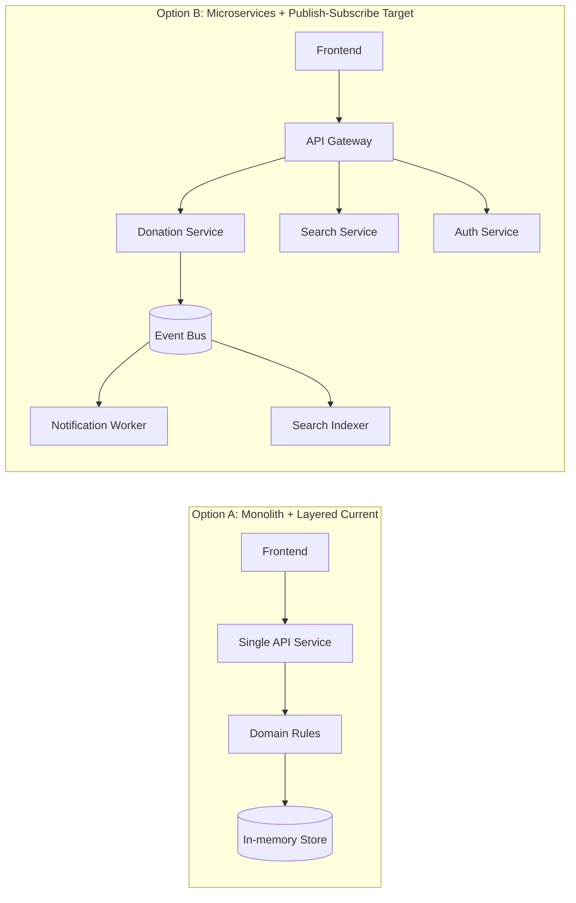

#### Side-by-side architecture matrix (quick view)

| Comparison Dimension | Option A: Monolith + Layered | Option B: Microservices + Pub-Sub | Better Fit |
|---|---|---|---|
| Team productivity (small team) | High | Medium | Option A |
| Deployment simplicity | High | Medium-Low | Option A |
| Per-request latency | Lower | Higher (extra hops) | Option A |
| Horizontal scaling at high load | Medium | High | Option B |
| Fault isolation between modules | Medium | High | Option B |
| Event-driven extensibility | Medium | High | Option B |
| Early-stage infrastructure cost | Low | Medium-High | Option A |
| Long-term growth flexibility | Medium | High | Option B |

### 8.3 Quantification Method (How Numbers Were Derived)

These values are architecture-level planning estimates and should be validated with runtime load tests.

Assumptions used:
- Same cloud region and similar VM/container class for both options.
- Core API path measured without heavy media-processing workloads.
- Traffic profile: mixed read/write, steady-state load, not worst-case burst.
- P95 latency is used because tail latency is more meaningful for user experience than average latency.

### 8.4 Quantified NFR Results

| Non-Functional Requirement | Option A: Monolith + Layered (implemented) | Option B: Microservices + Pub-Sub (target) | Analysis |
|---|---:|---:|---|
| Response time (P95 at ~200 req/s) | 60-110 ms | 100-180 ms | Option A is faster per request because calls remain in-process and avoid inter-service hops. |
| Throughput (sustained read/write mix) | 250-400 req/s per instance | 900-1500 req/s with horizontal scaling | Option B handles larger aggregate load through independent service scaling and async workers. |
| Availability feasibility | 99.0-99.5% in single-service deployment | 99.9% with redundancy + broker + failover | Option B supports higher uptime goals but depends on stronger operational maturity. |

Interpretation:
- For pilot traffic, Option A provides better latency and lower complexity.
- For growth-stage traffic, Option B provides better throughput and resilience.

### 8.5 Trade-offs (Detailed)

1. Performance vs Scalability
  - Option A wins on low-latency response for moderate traffic.
  - Option B wins on scaling capacity for high sustained demand.

2. Simplicity vs Operability Overhead
  - Option A is easier to develop, deploy, debug, and reason about.
  - Option B introduces service discovery, tracing, broker operations, and more failure modes.

3. Strong Synchronous Control vs Event Decoupling
  - Option A keeps critical transitions simple and synchronous.
  - Option B decouples side effects effectively, but requires idempotency and eventual-consistency handling.

4. Early Cost vs Long-Term Flexibility
  - Option A has lower baseline infrastructure and team overhead.
  - Option B has higher baseline cost but better long-term control of independent scaling.

### 8.6 Decision and Migration Plan

- Current decision:
  - Keep Option A for prototype and pilot release.
- Migration triggers:
  - Sustained load consistently beyond ~400 req/s.
  - Search/indexing lag violating agreed SLA.
  - Notification or background jobs degrading API latency.
- Phased migration path:
  1. Extract Search service first.
  2. Extract Notification service and introduce broker-backed consumers.
  3. Keep transactional listing updates centralized until consistency guarantees are preserved in the distributed flow.

Final conclusion:
The implemented architecture is the right choice for current scope and delivery speed, while the target architecture remains justified for future scale. This preserves practical execution now and a clear growth path later.

---

## 9. Advancements Beyond Initial Proposal

This section focuses only on implementation advancements beyond the initial proposal.

### 9.1 Deployment Highlight

The whole FoodBridge system has been deployed.

- Frontend and backend are running and accessible.
- The end-to-end user flow is available in deployment:
  - create listing -> search listing -> claim listing.
- This confirms the project is not only designed, but also delivered as a working system.

### 9.2 Extra Implementation Work Completed

Compared to the original proposal, these implementation-level improvements were completed:

| Implementation Area | Initially Expected | Extra Work Delivered |
|---|---|---|
| End-to-end flow reliability | Basic prototype flow | Full create/search/claim path with explicit status transitions and safe claim behavior |
| Access control in runtime | RBAC planned in design | Claim endpoint enforces role guard (`x-role`) and blocks unauthorized claims |
| Data consistency in claim flow | Functional flow demonstration | Added lifecycle guard so only `available` listings can be claimed |
| Runtime operability | Core APIs only | Added health endpoint for service status checks (`GET /health`) |
| Deployment readiness | Prototype demonstration | Deployed frontend + backend with live end-to-end execution |

### 9.3 Implementation Evidence in Repository

- `prototype/backend/index.js`
  - `POST /api/v1/listings` creates listing with initial state.
  - `GET /api/v1/search` returns currently available listings.
  - `POST /api/v1/listings/:id/claim` enforces role and state checks before claim.
  - `GET /health` provides runtime health check.
- `prototype/backend/README.md`
  - Documents endpoint usage and role header requirement.

### 9.4 Why This Matters

The key advancement is implementation maturity: the project moved from planned functionality to deployed, testable runtime behavior with security and consistency checks in the core flow.

---

## 10. Team Contributions and Submission Details

### 10.1 Individual Contributions (Balanced Load)

The project work was divided equally among 4 members, with each member handling one major implementation track (25% each).

| Name | Roll No | Contribution |
|---|---:|---|
| Priyanshu Jha | 2024201062 | Testing, bug fixing, and deployment verification for the complete working system |
| Abhishek Kumar | 2024201050 | Backend implementation for core APIs and business rules (create/search/claim + role/state checks) |
| Vivek Kumar Chandan | 2024201032 | Frontend implementation for core user flow (create/search/claim UI and API integration) |
| Vaibhav Gupta | 2024201044 | End-to-end integration, validation logic, and runtime stability improvements |

### 10.2 GitHub Repository Link

- SE Project Repository: https://github.com/Priyanshu-Jha/FoodBridge-

### 10.3 Moodle Submission Note

- As per instruction, only one team member will submit on Moodle on behalf of Team 45.
- Team decision: Priyanshu Jha will perform the final Moodle submission, including the report and repository link.

